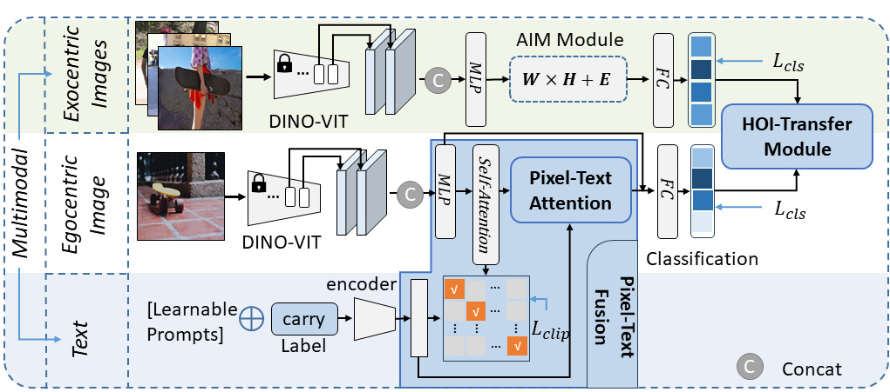

# Weakly Supervised Multimodal Affordance Grounding for Egocentric Images
## Paper
>Weakly Supervised Multimodal Affordance Grounding for Egocentric Images(AAAI 2024)
 
Link: https://doi.org/10.1609/aaai.v38i6.28451

>Appendix
  
Link: [Appendix.pdf](/docs)

>Video

Link: [video.mp4](/docs)

<p align="center"> <br></p>

**Abstract:**

To enhance the interaction between intelligent systems and the environment, locating the affordance regions of objects is crucial. These regions correspond to specific areas that provide distinct functionalities. Humans often acquire the ability to identify these regions through action demonstrations and verbal instructions. In this paper, we present a novel multimodal framework that extracts affordance knowledge from exocentric images, which depict human-object interactions, as well as from accompanying textual descriptions that describe the performed actions. The extracted knowledge is then transferred to egocentric images. To achieve this goal, we propose the HOI-Transfer Module, which utilizes local perception to disentangle individual actions within exocentric images. This module effectively captures localized features and correlations between actions, leading to valuable affordance knowledge. Additionally, we introduce the Pixel-Text Fusion Module, which fuses affordance knowledge by identifying regions in egocentric images that bear resemblances to the textual features defining affordances. We employ a Weakly Supervised Multimodal Affordance (WSMA) learning approach, utilizing image-level labels for training. Through extensive experiments, we demonstrate the superiority of our proposed method in terms of evaluation metrics and visual results when compared to existing affordance grounding models. Furthermore, ablation experiments confirm the effectiveness of our approach.

## Requirements
We run in the following environment: 
- A GeForce RTX 3090
- Python(3.8)
- Pytorch(1.10.0)

## Required pre-trained models
- model for Dino_vit
- model for text_enconder(clip):You can find it [here](https://openaipublic.azureedge.net/clip/models/afeb0e10f9e5a86da6080e35cf09123aca3b358a0c3e3b6c78a7b63bc04b6762/RN50.pt)

## Start Train
```bash
git clone https://github.com/xulingjing88/WSMA.git
cd WSMA
```
Before training, you need to preprocess the data
- Seen, Unseen(from AGD20K): You can find it [here](https://github.com/lhc1224/Cross-View-AG/tree/main/code/cvpr)
- HICO-IIF: You can find it [here]()
```bash
python preprocessing.py
```

